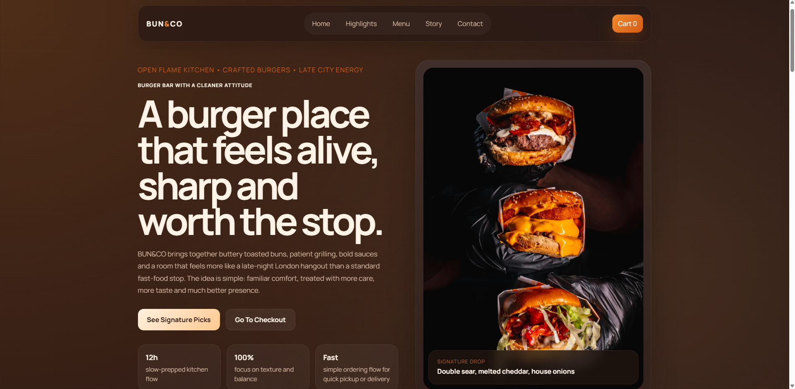
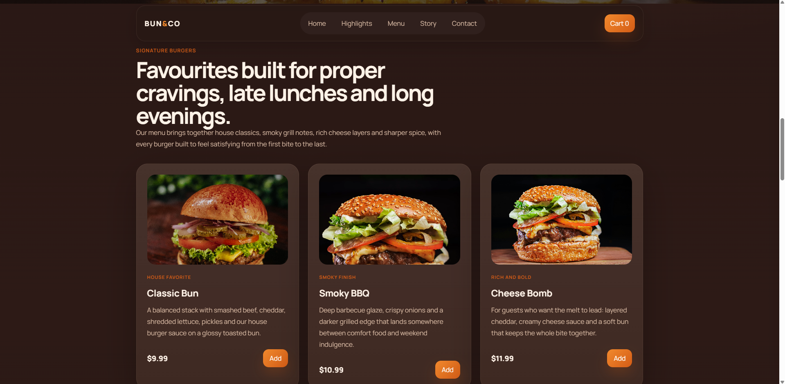
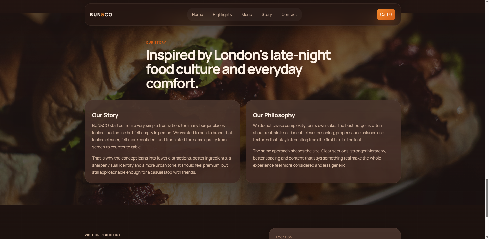

# BUN&CO

A frontend landing page concept for a modern burger brand based around a bold London-inspired identity, warm visual styling, and a simple order flow.

## Overview

BUN&CO is a static frontend project focused on presentation, branding, and user experience.  
The site combines a strong hero section, signature burger cards, story-driven brand content, and a lightweight cart + checkout flow designed for a clean browsing experience on desktop and mobile.

## Highlights

- Responsive one-page layout with anchored navigation
- Custom landing sections with stronger brand-focused copy
- Signature burger grid with real image assets
- Slide-in cart with quantity controls, totals, and remove actions
- Simple checkout section for a lightweight ordering flow
- London-themed content direction and warm fast-food-inspired visual language

## Tech Stack

- HTML5
- CSS3
- Vanilla JavaScript

## Desktop Preview

### Landing



### Menu



### Story



## Project Structure

```text
bun and co/
|- assets/
|  |- images/
|  |- screenshots/
|- index.html
|- style.css
|- script.js
|- README.md
```

## Local Preview

Since this is a static frontend project, you can run it with any simple local server and open `index.html` in the browser.

## Notes

This project is currently centered on the frontend experience, visual direction, and basic cart/checkout interaction rather than backend integration or production payment processing.
